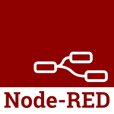
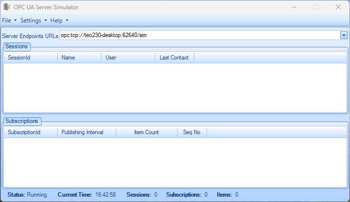
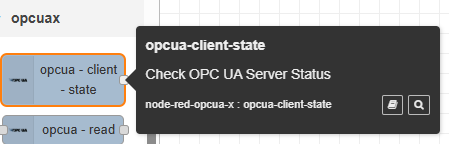
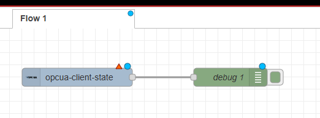
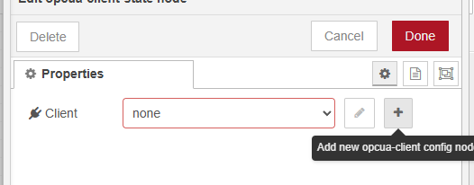
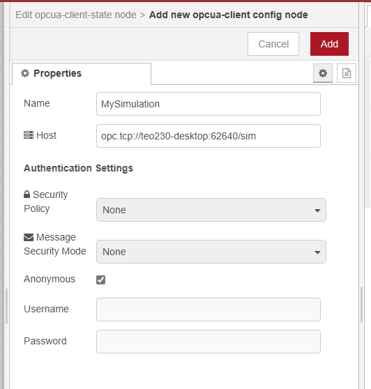
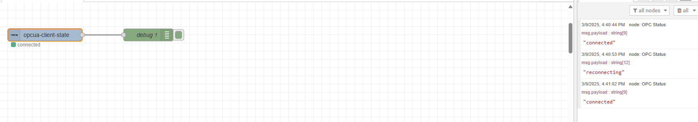

# node-red-opcua-x
 
<!--   -->

## What is
A package that handles OPC UA Client request like read, browse, write, ...

## Versioning
The following package use the semantic versioning template

`X.Y.Z`

- X is the `Major` version, when the following number change, the package can be not compatible with the previous versions
- Y is the `Minor` version, when the following number change, the package is compatible with the previous version with the same Major version
- Z is the `Patch` version, when the following number change, has the same purpose of Minor but is used for no codes change (update pipeline, wiki, references, ...)

By now the package is only use the `Minor` because is in prerelease state.
The first stable version will start from `1.0.0`

## Features

- [x] Read
- [x] Write
- [x] Browse
- [x] Check connection status
- [x] Subscription
- [ ] Events
- [ ] Methods
- [x] Connection security access
- [x] Simple Server (sample server for testing)
- [ ] Advanced Server

# Getting started
From node-red search for `node-red-opcua-x`

Run command on Node-RED installation directory.
	
    npm i node-red-opcua-x

or run command for global installation.

	npm i -g node-red-opcua-x

# Getting started - Developing

## Requirements
- Node-RED version: v4.0.9
- Node.js  version: v20.18.0

## OPC Server simulation
For testing I use the following OPC UA Server simulator

[OPC Server Simulator - Integration Objects](https://integrationobjects.com/sioth-opc/sioth-opc-servers/opc-server-simulators/)

## Setup

### Import Library

1. From the cloned folder run `npm i`
2. Open a new terminal inside the node-red source folder
3. Execute the following command `npm i <local folder node-red-opcua-x installation>`
4. Restart node-red
5. You should be able to see the imported package

### Setup
1. Start the OPC UA Server Simulator and copy the `Server Endpoints URLs` url

2. Select the `opcua-client-state` or just import the `client-state.json` sample

3. Open the `opcua-client-state` node and setup the client with endpoint, name, username, ...

4. Deploy the flow!

